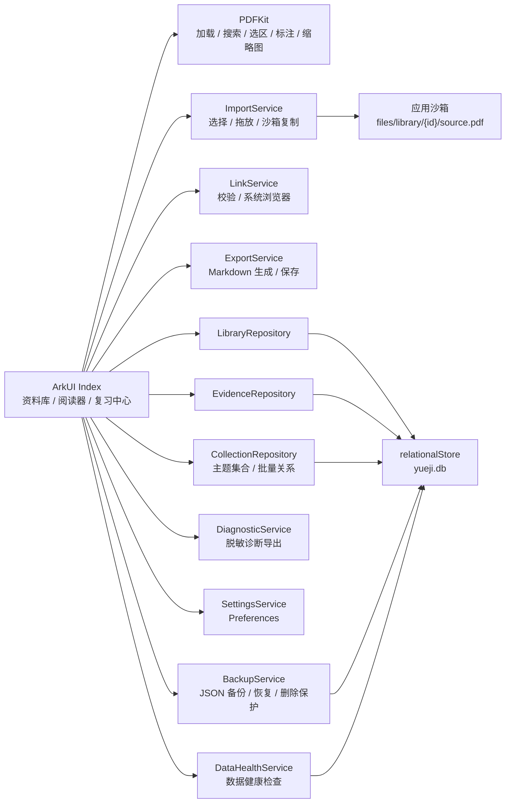
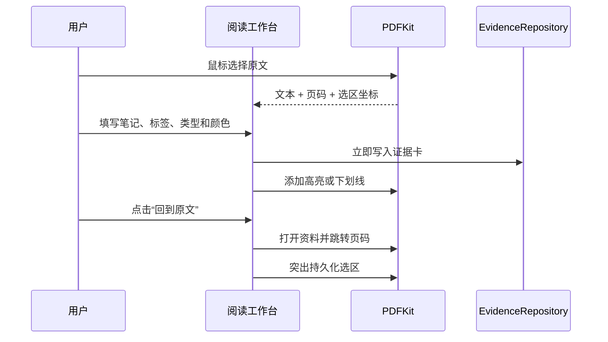

# 技术架构

## 设计原则

1. 本地优先：PDF、摘录、笔记和数据库只保存在应用沙箱。
2. 来源可追溯：证据卡持久化资料 ID、页码和 PDF 选区坐标。
3. 失败可恢复：导入先复制文件，解析和数据库写入成功后才进入资料库。
4. 发布可控：首版不引入账号、云同步、OCR、AI 或内嵌浏览器。

## 模块关系

## 证据卡闭环

## 数据表

`documents` 保存 PDF 和网页资料：

- `id`
- `kind`
- `title`
- `source`
- `page_count`
- `current_page`
- `tags`
- `favorite`
- `excerpt`
- `note`
- `created_at`
- `last_read_at`

`evidence_cards` 保存 PDF 证据：

- `id`
- `document_id`
- `quote`
- `page_index`
- `rects_json`
- `note`
- `kind`
- `color`
- `tags`
- `review_status`
- `created_at`
- `updated_at`

## 导入事务边界

1. 文件选择器或拖放提供 URI。
2. 应用创建资料 ID 和沙箱目录。
3. 原文件复制为 `files/library/{documentId}/source.pdf`。
4. PDFKit 解析沙箱副本。
5. 解析成功后写入 `documents`。
6. 解析或数据库写入失败时删除刚复制的文件。

## 丢失副本恢复

1. 资料卡发现沙箱 `source.pdf` 不存在时保留数据库记录、证据卡、标签、收藏和阅读进度。
2. 用户点击“重新导入”并选择原始 PDF，文件仍复制到原资料 ID 对应的沙箱路径。
3. 独立 PDF 控制器先验证格式和页数；解析失败或页数与原记录不一致时删除新副本，不修改数据库。
4. 校验成功后把阅读页限制在有效范围，更新页数并使用原资料 ID 打开阅读器。
5. 证据卡通过未变化的资料 ID 自动恢复标注和来源回跳。

## 备份、恢复与删除保护

1. 用户主动选择保存位置后，`BackupService` 导出版本化 JSON；JSON 保存资料、证据卡、主题集合、关联和界面设置，不包含 PDF 二进制文件。
2. 恢复前先把当前结构化数据保存到应用沙箱快照目录，再校验备份结构并通过数据库事务替换记录。
3. 恢复时把 PDF 资料路径标准化为当前设备的 `files/library/{documentId}/source.pdf`。由于备份不携带 PDF 文件，缺失副本会保留资料卡并提示重新导入。
4. 删除 PDF 前保存删除前快照，并把 PDF 移入本地删除归档；数据库删除失败时恢复原文件，数据库删除成功后立即销毁归档文件和临时目录。
5. 快照只保留最近若干份，避免重复操作无限增长。

## 数据健康与诊断

`DataHealthService` 在启动和用户主动检查时验证：

- PDF 是否存在、是否位于当前应用沙箱的标准路径，以及是否存在孤立 PDF；
- 证据卡类型是否与 PDF/网页来源匹配，回跳页、选区页和选区坐标是否可恢复；
- 主题集合、资料和证据卡之间的关联是否完整；
- 网页资料是否使用 `http` 或 `https` 地址。

`DiagnosticService` 只导出应用版本、API、数据库版本、数量和问题计数，不导出 PDF 正文、摘录、笔记、网址或用户身份信息。

## 数据库升级

数据库通过 `schema_meta` 保存当前 schema 版本。应用初始化时先创建基础表，再以幂等方式补齐当前版本字段，随后创建依赖这些字段的索引、清理触发器并移除孤儿关系；这既支持旧版本升级，也能修复 schema 标记存在但字段不完整的异常数据库。不支持降级到高于当前应用的数据库版本。

## 复习调度

- 编辑原文笔记、标签、标注样式但不改变复习状态时，保留原有复习次数和到期时间。
- 在编辑器中把待复习卡明确改为已掌握，或在专注复习中点击掌握时，才记录一次复习。
- 已掌握卡到期后会重新进入复习队列；普通编辑不会把它误判为已经复习。

## 已知边界

- 加密 PDF 首版不支持密码输入。
- 网页资料不抓取正文，只保存用户手动提供的链接、摘录和笔记。
- 标注显示由证据卡重建，不修改原始 PDF 文件。
- JSON 备份不包含 PDF 二进制文件，跨设备恢复后仍需重新导入缺失 PDF。
- 系统级备份恢复能力保持关闭，应用内 JSON 备份由用户主动操作。
- 当前不包含“另存为带标注 PDF”。
