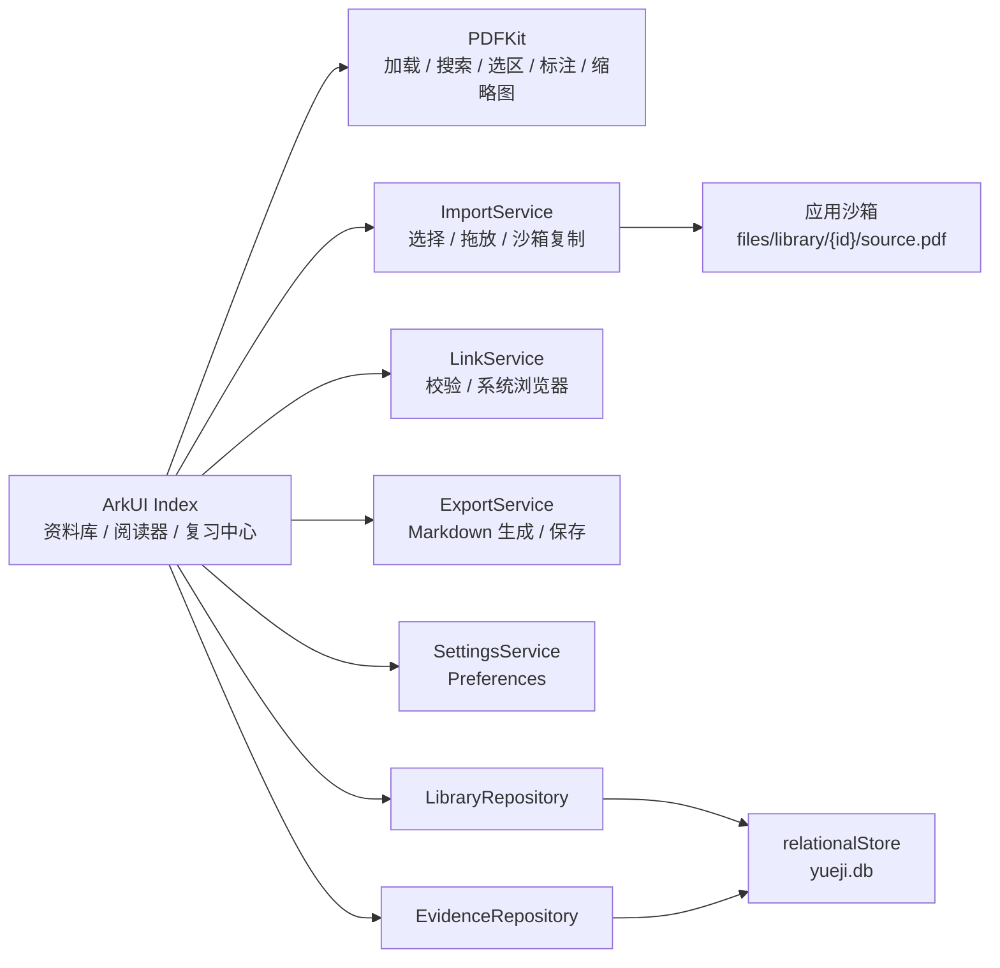
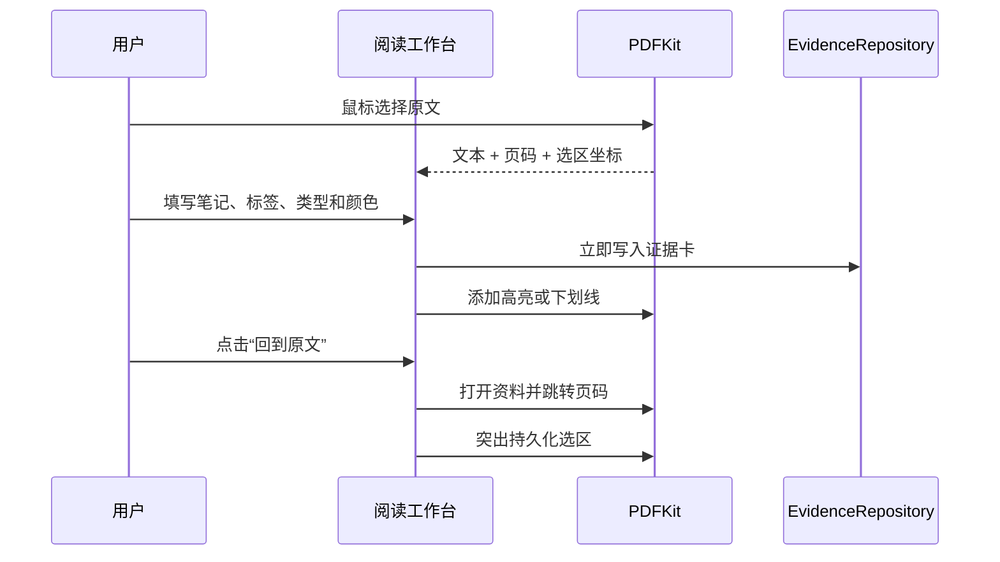

# 技术架构

## 设计原则

1. 本地优先：PDF、摘录、笔记和数据库只保存在应用沙箱。
2. 来源可追溯：证据卡持久化资料 ID、页码和 PDF 选区坐标。
3. 失败可恢复：导入先复制文件，解析和数据库写入成功后才进入资料库。
4. 发布可控：首版不引入账号、云同步、OCR、AI 或内嵌浏览器。

## 模块关系

## 证据卡闭环

## 数据表

`documents` 保存 PDF 和网页资料：

- `id`
- `kind`
- `title`
- `source`
- `page_count`
- `current_page`
- `tags`
- `favorite`
- `excerpt`
- `note`
- `created_at`
- `last_read_at`

`evidence_cards` 保存 PDF 证据：

- `id`
- `document_id`
- `quote`
- `page_index`
- `rects_json`
- `note`
- `kind`
- `color`
- `tags`
- `review_status`
- `created_at`
- `updated_at`

## 导入事务边界

1. 文件选择器或拖放提供 URI。
2. 应用创建资料 ID 和沙箱目录。
3. 原文件复制为 `files/library/{documentId}/source.pdf`。
4. PDFKit 解析沙箱副本。
5. 解析成功后写入 `documents`。
6. 解析或数据库写入失败时删除刚复制的文件。

## 已知边界

- 加密 PDF 首版不支持密码输入。
- 网页资料不抓取正文，只保存用户手动提供的链接、摘录和笔记。
- 标注显示由证据卡重建，不修改原始 PDF 文件。
- 当前不包含 JSON 备份恢复和“另存为带标注 PDF”。
